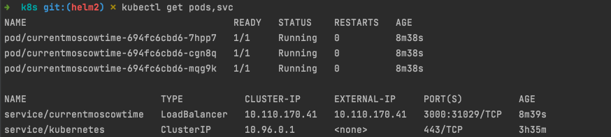
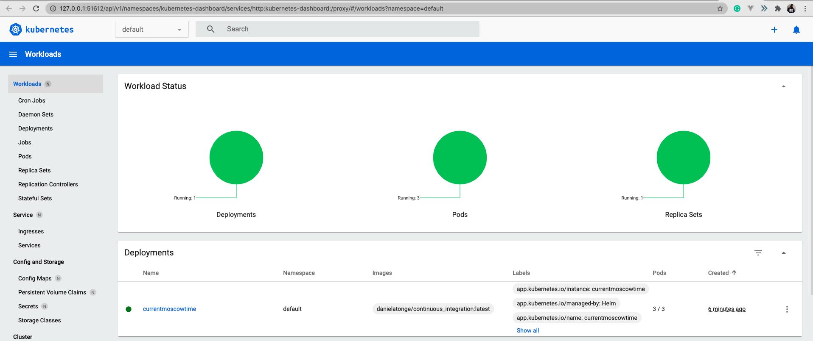

# Kubernetes
## Installations
[Minikube](https://minikube.sigs.k8s.io/) and [Kubernetes]( https://kubernetes.io/)  was installed for this lab using homebrew.
## Tasks
1. Deploy your application in the Kubernetes. Use the kubectl create command to create a Deployment:
    


2. Make your application accessible from outside the Kubernetes virtual network. Create a Service for it:
    
    
    


3. Provide the output of `kubectl get pods,svc` command:
    


4. Clean up. Remove deployment and service that you created: 
    ```bash
    kubectl delete deployment,svc currentmoscowtime
    ```
5. Use configuration files to deploy your
application. Create a deployment.yml manifest for it. Set up at least 3 replicas:
    ```bash
    kubectl apply -f statefulset.yaml 
    ```
6. Create a service.yml manifest for your app: 
    ```bash
    kubectl apply -f service.yaml 
    ```
7. Provide the output of `kubectl get pods,svc` command:
    


8. Clean up. Remove deployment and service that you created: 
    ```bash
    kubectl delete deployment,svc currentmoscowtime
    ```

# HELM
1. Create a helm chart template:
    ```bash
    helm create currentmoscowtime
    ```
2. `deployment.yaml`, `service.yaml` and `values.yaml` were modified accordingly to my image, tag, port and type of service.


3. Install my helm chart: 
    ```bash
    helm install currentmoscowtime currentmoscowtime
    ```
4. Check it by `minikube service currentmoscowtime` and provide the output of `kubectl get pods,svc` command:
    
   
   